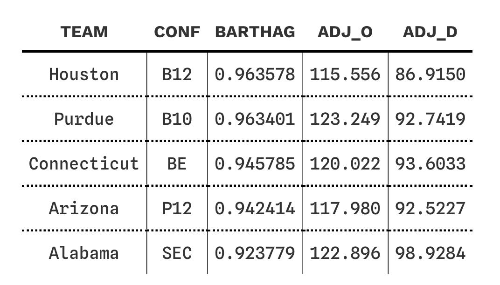
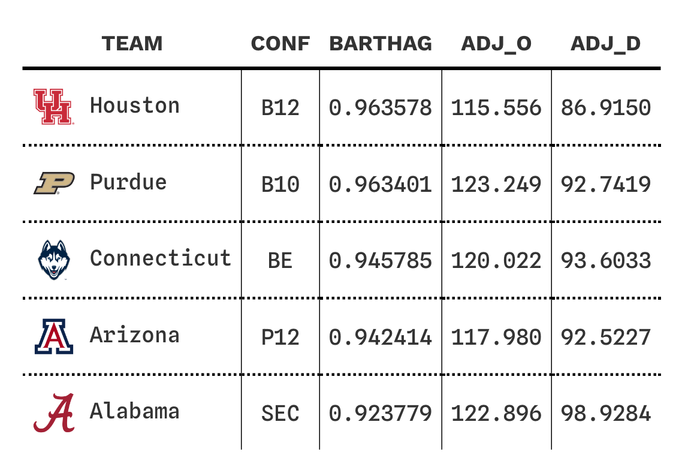

<!-- README.md is generated from README.Rmd. Please edit that file -->

# Welcome to CBBData: Your Gateway to In-Depth College Basketball Insights

<!-- badges: start -->
<!-- badges: end -->

In the vast arena of college basketball data, finding comprehensive,
easily accessible, and up-to-date statistics can be a daunting task.
cbbdata emerges as your reliable partner in this quest, offering an
unparalleled depth of college basketball insights, just a line of code
away.

**Unmatched Access, Uncomplicated Process:** `cbbdata` is your key to
unlocking a treasure trove of college basketball statistics. Say goodbye
to the hurdles of data scraping. Our package is designed for efficiency
and simplicity, providing a straightforward pathway to the data you
need.

**Powered by Precision and Speed:** At the heart of `cbbdata` lies a
robust architecture, powered by Flask and Python. Leveraging SQL queries
and direct file transfers, we ensure you receive the most accurate and
recent data. Our commitment to speed and reliability means you get the
data you need, when you need it, without the wait.

**Diverse Data at Your Fingertips:** Whether you’re looking for detailed
player stats, team analytics, game outcomes, or advanced metrics,
`cbbdata` has it all. Our comprehensive database is constantly evolving,
bringing you the latest and most detailed insights into the college
basketball world.

**Getting Started is Easy:** Begin your journey with `cbbdata` by
signing up for a free API key. With this key, a world of college
basketball data awaits you. Experience the ease and power of `cbbdata`
and elevate your analysis to the next level.

## Installation

You can install the development version of `cbbdata` from GitHub with:

``` r
# install.packages("devtools")
devtools::install_github("andreweatherman/cbbdata")
```

## Registering for an API key

An API key is free and easy to obtain by using the official `cbbdata` R
package. To register, simply pass a username and password to the
`cbd_create_account` endpoint. Your API key will be emailed to you –
make sure to check your spam folder – but you need not manually store
your API key anywhere. The preferred way to access your account is with
your username and password.

*Note: If you want to access KenPom data, your CBBData account email
must match your KenPom account email*

``` r
# to register
cbbdata::cbd_create_account(username = 'xxx', email = 'xxx', password = 'xxx', confirm_password = 'xxx')
```

## Obtaining Your Key

After registering, there are two ways to obtain your key using the
`cbbdata` R package.

### By-Session Log-In:

To obtain your key for use in your current R session, you can pass your
username and password to the `cbd_login` function. This will retrieve
your key and store it as a session variable. If you restart or leave
your R session, you will need to log-in again.

``` r
# per-session log-in
cbbdata::cbd_login(username = 'xxx', password = 'xxx')
```

### Persistent Log-In (Preferred):

The recommended way to interact with the `CBBData` API is to store your
username (`CBD_USER`) and password (`CBD_PW`) inside the .Renviron file.
If you are unsure on how to do this, the `cbd_login` function will walk
you through the process. Please note that this *will* require restarting
your R session.

``` r
# persistent log-in
cbbdata::cbd_login()
```

If your API key is not stored as a session variable, `cbbdata` functions
will grab your credentials from the .Renviron file and automatically log
you in. With this method, you will not have to log-in again.

## Available Data

`cbbdata` provides broad access to leading college basketball resources.
`cbbdata` is continuously growing and the available data includes:

### Barttorvik:

Developer [Andrew Weatherman](https://twitter.com/andreweatherman) wrote
the popular `toRvik` R package. `cbbdata` replaces `toRvik` and brings
with it a rich collection of Barttorvik data.

#### Metric Ratings:

-   Year-end ratings (`cbd_torvik_ratings`)
-   Day-by-day ratings (`cbd_torvik_ratings_archive`)
-   Team four factor splits (`cbd_torvik_team_factors`)

E.g., if you want to see what the no-bias T-Rank top 10 looks like:

``` r
cbbdata::cbd_torvik_team_factors(year = 2024, no_bias = TRUE) %>%
  dplyr::slice(1:10) %>%
  dplyr::select(team, barthag, adj_o, adj_d)
#> # A tibble: 10 × 4
#>    team        barthag adj_o adj_d
#>    <chr>         <dbl> <dbl> <dbl>
#>  1 Houston       0.983  116.  81.2
#>  2 Purdue        0.972  124.  91.1
#>  3 Arizona       0.971  119.  87.7
#>  4 Connecticut   0.963  125.  93.9
#>  5 BYU           0.956  118.  90.1
#>  6 Oklahoma      0.948  114.  88.8
#>  7 Auburn        0.947  119.  93.0
#>  8 Iowa St.      0.946  116.  90.1
#>  9 Alabama       0.940  129. 102. 
#> 10 Marquette     0.933  118.  93.8
```

#### Player Data:

-   Individual game logs (`cbd_torvik_player_game`)
-   Season averages (`cbd_torvik_player_season`)
-   Season splits (`cbd_torvik_player_split`)

E.g., if you want to see which ACC player averages the most points at
home:

``` r
cbbdata::cbd_torvik_player_split(year = 2024, conf = 'ACC', split = 'location') %>%
  dplyr::filter(games >= 3) %>%
  dplyr::slice_max(pts, n = 1) %>%
  dplyr::select(team, player, pts, games)
#>        team      player pts games
#> 1: Syracuse Judah Mintz  26     5
```

#### Team + Conference Data:

-   Team stats splits (`cbd_torvik_team_split`)
-   Team histories (`cbd_torvik_team_history`)
-   Conference four factor splits (`cbd_torvik_conf_factors`)

E.g., if you want to see which conferences shoot the best at home
against top 100 teams:

``` r
cbbdata::cbd_torvik_conf_factors(2024, venue = 'home', top = 100) %>%
  dplyr::filter(games >= 5) %>%
  dplyr::slice_max(efg, n = 5) %>%
  dplyr::select(conf, games, efg)
#> # A tibble: 5 × 3
#>   conf  games   efg
#>   <chr> <dbl> <dbl>
#> 1 P12       6  55.5
#> 2 SEC      13  51.1
#> 3 BE       14  50.7
#> 4 ACC      12  50.4
#> 5 Amer      5  49.5
```

#### Game Data:

-   Individual game box (`cbd_torvik_game_box`)
-   Individual game four factors (`cbd_torvik_game_factors`)
-   Individual game stats (box + factors) (`cbd_torvik_game_stats`)
-   Season schedule (`cbd_torvik_season_schedule`)

E.g., if you want to track how Duke’s offense has performed this season:

``` r
cbbdata::cbd_torvik_game_factors(year = 2024, team = 'Duke') %>%
  ggplot2::ggplot(aes(date, adj_o)) +
  ggplot2::geom_line() +
  ggplot2::geom_point(aes(color = result), size = 3) +
  ggplot2::scale_color_manual(values = c('darkred', 'darkgreen'), guide = NULL) +
  ggplot2::theme_minimal()
```


#### Predictions

-   Individual game predictions (`cbd_torvik_game_prediction`)
-   Team season predictions (`cbd_torvik_season_prediction`)
-   Team season simulations (`cbd_torvik_season_simulation`)

E.g., if you want to run 10,000 simulations of Duke’s season with their
performance as of today:

``` r
# no date -> defaults to today
cbbdata::cbd_torvik_season_simulation('Duke', 2024) %>%
  ggplot2::ggplot(aes(wins, probability)) +
  ggplot2::geom_col() +
  ggplot2::scale_y_continuous(labels = scales::label_percent())
```


#### Tournament Results + Resumes

-   Daily NET rankings and quadrant records
    (`cbd_torvik_current_resume`)
-   Tournament performance (`cbd_torvik_ncaa_results`)
-   Tournament “committee sheets” (`cbd_torvik_ncaa_sheets`)
-   Resume database (`cbd_torvik_resume_database`)
-   Similar team tournament resumes (`cbd_torvik_similar_resumes`)

E.g., if you want to pull the five teams with the most Q1 NET wins:

``` r
cbbdata::cbd_torvik_current_resume() %>%
  dplyr::mutate(q1_wins = readr::parse_number(quad1)) %>%
  dplyr::slice_max(q1_wins, n = 5) %>%
  dplyr::select(team, conf, q1_wins, net)
#> # A tibble: 7 × 4
#>   team      conf  q1_wins   net
#>   <chr>     <chr>   <dbl> <int>
#> 1 Purdue    B10         5     3
#> 2 Houston   B12         4     1
#> 3 Arizona   P12         3     2
#> 4 Kansas    B12         3    13
#> 5 Clemson   ACC         3    15
#> 6 Wisconsin B10         3    17
#> 7 Texas A&M SEC         3    22
```

### KenPom

To access KenPom data, you must have an active KenPom subscription and
your CBBData account email must match your KenPom account email; this
exists to curb account sharing. To activate your account, pass your
**KenPom** account password through the `cbd_kenpom_authorization`
function. The CBBData API will then confirm your account is active and
log your expiration date. You will only be asked to re-authorize on that
date.

``` r
# persistent log-in
cbbdata::cbd_kenpom_authorization(password = 'xxx')
```

#### Metric Ratings:

-   Year-end ratings (`cbd_kenpom_ratings`)
-   Day-by-day ratings (`cbd_kenpom_ratings_archive`)

### Other

`cbbdata` ships with the `gt_theme_athletic` theme for `gt` tables. The
theme is perfect for stat-focused tables, giving them a classic,
monospaced feel.

``` r
cbbdata::cbd_torvik_ratings(year=2024) %>%
  dplyr::slice(1:5) %>%
  dplyr::select(team, conf, barthag, adj_o, adj_d) %>%
  gt::gt() %>%
  cbbdata::gt_theme_athletic()
```



Also included in `cbbdata` is a helper function for plotting team logos
with `gt`. Simply pass in a dataframe with team names, specify where
your ‘team’ logo resides, and the name of the new column (using the same
name as your ‘team’ column will replace that column – perfect for `gt`).

``` r
cbbdata::cbd_torvik_ratings(year=2024) %>%
  dplyr::slice(1:5) %>%
  dplyr::select(team, conf, barthag, adj_o, adj_d) %>%
  cbbdata::cbd_gt_logos(team, team) %>%
  gt::gt() %>%
  cbbdata::gt_theme_athletic() %>%
  gt::fmt_markdown(team) %>%
  gt::cols_align(columns = team, 'left')
```



## Support

The CBBData API is free to use but hosting it is not! If you find this
resource helpful, please kindly consider [supporting me and the project
on Ko-fi](https://ko-fi.com/andrewweatherman).
