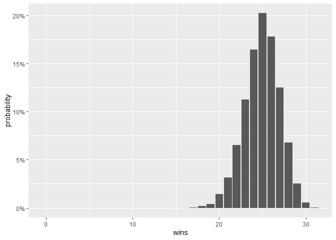

<!-- README.md is generated from README.Rmd. Please edit that file -->

# CBBData, Your Gateway to In-Depth College Basketball Insights

<!-- badges: start -->
<!-- badges: end -->

Getting reliable, up-to-date college basketball data shouldn’t be a
hassle. With `cbbdata`, it isn’t. This package makes it straightforward
to access a wide range of stats with minimal effort.

**Easy Access:** `cbbdata` simplifies the process of fetching college
basketball statistics. No more scraping or searching through multiple
sources: just clean, easy access to the data you need.

**Fast and Accurate:** Built with Flask and Python, `cbbdata` uses SQL
queries and direct file transfers to ensure you get accurate and current
data quickly. Our database is updated every 15 minutes during the
season.

**Comprehensive Data:** Whether you need player stats, team analytics,
game results, or advanced metrics, `cbbdata` has you covered with nearly
30 endpoints.

## Installation

You can install the development version of `cbbdata` from GitHub with:

``` r
# install.packages("devtools")
devtools::install_github("andreweatherman/cbbdata")
```

## Registering for an API key

An API key is free and easy to obtain by using the official `cbbdata` R
package. To register, simply pass a username and password to the
`cbd_create_account` endpoint. Your API key will be emailed to you –
make sure to check your spam folder – but you need not manually store
your API key anywhere. The preferred way to access your account is with
your username and password.

*Note: If you want to access KenPom data, your CBBData account email
must match your KenPom account email*

``` r
# to register
cbbdata::cbd_create_account(username = 'xxx', email = 'xxx', password = 'xxx', confirm_password = 'xxx')
```

## Obtaining Your Key

After registering, there are two ways to obtain your key using the
`cbbdata` R package.

### By-Session Log-In:

To obtain your key for use in your current R session, you can pass your
username and password to the `cbd_login` function. This will retrieve
your key and store it as a session variable. If you restart or leave
your R session, you will need to log-in again.

``` r
# per-session log-in
cbbdata::cbd_login(username = 'xxx', password = 'xxx')
```

### Persistent Log-In (Preferred):

The recommended way to interact with the `CBBData` API is to store your
username (`CBD_USER`) and password (`CBD_PW`) inside the .Renviron file.
If you are unsure on how to do this, the `cbd_login` function will walk
you through the process. Please note that this *will* require restarting
your R session.

``` r
# persistent log-in
cbbdata::cbd_login()
```

If your API key is not stored as a session variable, `cbbdata` functions
will grab your credentials from the .Renviron file and automatically log
you in. With this method, you will not have to log-in again.

## Available Data

`cbbdata` provides broad access to leading college basketball resources.
`cbbdata` is continuously growing and the available data includes:

### Barttorvik:

Developer [Andrew Weatherman](https://twitter.com/andreweatherman) wrote
the popular `toRvik` R package. `cbbdata` replaces `toRvik` and brings
with it a rich collection of Barttorvik data.

#### Metric Ratings:

- Year-end ratings (`cbd_torvik_ratings`)
- Day-by-day ratings (`cbd_torvik_ratings_archive`)
- Team four factor splits (`cbd_torvik_team_factors`)

E.g., if you want to see what the no-bias T-Rank top 10 looks like:

``` r
cbbdata::cbd_torvik_team_factors(year = 2024, no_bias = TRUE) %>%
  dplyr::slice(1:10) %>%
  dplyr::select(team, barthag, adj_o, adj_d)
#> # A tibble: 10 × 4
#>    team           barthag adj_o adj_d
#>    <chr>            <dbl> <dbl> <dbl>
#>  1 Houston          0.978  119.  85.7
#>  2 Connecticut      0.977  127.  92.0
#>  3 Purdue           0.967  126.  93.8
#>  4 Auburn           0.953  120.  92.6
#>  5 Arizona          0.952  121.  93.0
#>  6 Iowa St.         0.950  114.  88.0
#>  7 Tennessee        0.945  116.  90.5
#>  8 North Carolina   0.937  119.  93.9
#>  9 Duke             0.935  121.  95.7
#> 10 Marquette        0.928  118.  94.4
```

#### Player Data:

- Individual game logs (`cbd_torvik_player_game`)
- Season averages (`cbd_torvik_player_season`)
- Season splits (`cbd_torvik_player_split`)

E.g., if you want to see which ACC player averages the most points at
home:

``` r
cbbdata::cbd_torvik_player_split(year = 2024, conf = 'ACC', split = 'location') %>%
  dplyr::filter(games >= 10) %>%
  dplyr::slice_max(pts, n = 1) %>%
  dplyr::select(team, player, pts, games)
#>              team   player   pts games
#> 1: North Carolina RJ Davis 22.75    12
```

#### Team + Conference Data:

- Team stats splits (`cbd_torvik_team_split`)
- Team histories (`cbd_torvik_team_history`)
- Conference four factor splits (`cbd_torvik_conf_factors`)

E.g., if you want to see which conferences shoot the best at home
against top 100 teams:

``` r
cbbdata::cbd_torvik_conf_factors(2024, venue = 'home', top = 100) %>%
  dplyr::filter(games >= 5) %>%
  dplyr::slice_max(efg, n = 5) %>%
  dplyr::select(conf, games, efg)
#> # A tibble: 6 × 3
#>   conf  games   efg
#>   <chr> <dbl> <dbl>
#> 1 P12      78  52.8
#> 2 B10     125  51.6
#> 3 B12     121  51.3
#> 4 MWC      70  51.2
#> 5 BE      108  51.1
#> 6 ACC     112  51.1
```

#### Game Data:

- Individual game box (`cbd_torvik_game_box`)
- Individual game four factors (`cbd_torvik_game_factors`)
- Individual game stats (box + factors) (`cbd_torvik_game_stats`)
- Season schedule (`cbd_torvik_season_schedule`)

E.g., if you want to track how Duke’s offense has performed this season:

``` r
cbbdata::cbd_torvik_game_factors(year = 2024, team = 'Duke') %>%
  ggplot2::ggplot(aes(date, adj_o)) +
  ggplot2::geom_line() +
  ggplot2::geom_point(aes(color = result), size = 3) +
  ggplot2::scale_color_manual(values = c('darkred', 'darkgreen'), guide = NULL) +
  ggplot2::theme_minimal()
```


#### Predictions

- Individual game predictions (`cbd_torvik_game_prediction`)
- Team season predictions (`cbd_torvik_season_prediction`)
- Team season simulations (`cbd_torvik_season_simulation`)

E.g., if you want to run 10,000 simulations of Duke’s season with their
performance as of today:

``` r
# no date -> defaults to today
cbbdata::cbd_torvik_season_simulation('Duke', 2024) %>%
  ggplot2::ggplot(aes(wins, probability)) +
  ggplot2::geom_col() +
  ggplot2::scale_y_continuous(labels = scales::label_percent())
```



#### Tournament Results + Resumes

- Daily NET rankings and quadrant records (`cbd_torvik_current_resume`)
- Historical NET rankings and per-day metrics (`cbd_net_archive`)
- Tournament performance (`cbd_torvik_ncaa_results`)
- Tournament “committee sheets” (`cbd_torvik_ncaa_sheets`)
- Resume database (`cbd_torvik_resume_database`)
- Similar team tournament resumes (`cbd_torvik_similar_resumes`)

E.g., if you want to pull the five teams with the most Q1 NET wins:

``` r
cbbdata::cbd_torvik_current_resume() %>%
  dplyr::mutate(q1_wins = readr::parse_number(quad1)) %>%
  dplyr::slice_max(q1_wins, n = 5) %>%
  dplyr::select(team, conf, q1_wins, net)
#> # A tibble: 5 × 4
#>   team        conf  q1_wins   net
#>   <chr>       <chr>   <dbl> <int>
#> 1 Connecticut BE         19    12
#> 2 Purdue      B10        18    16
#> 3 Houston     B12        17     1
#> 4 Tennessee   SEC        14     5
#> 5 Texas A&M   SEC        13    21
```

### KenPom

To access KenPom data, you must have an active KenPom subscription and
your CBBData account email must match your KenPom account email; this
exists to curb account sharing. To activate your account, pass your
**KenPom** account password through the `cbd_kenpom_authorization`
function. The CBBData API will then confirm your account is active and
log your expiration date. You will only be asked to re-authorize on that
date.

``` r
# persistent log-in
cbbdata::cbd_kenpom_authorization(password = 'xxx')
```

#### Metric Ratings:

- Year-end ratings (`cbd_kenpom_ratings`)
- Day-by-day ratings (`cbd_kenpom_ratings_archive`)
